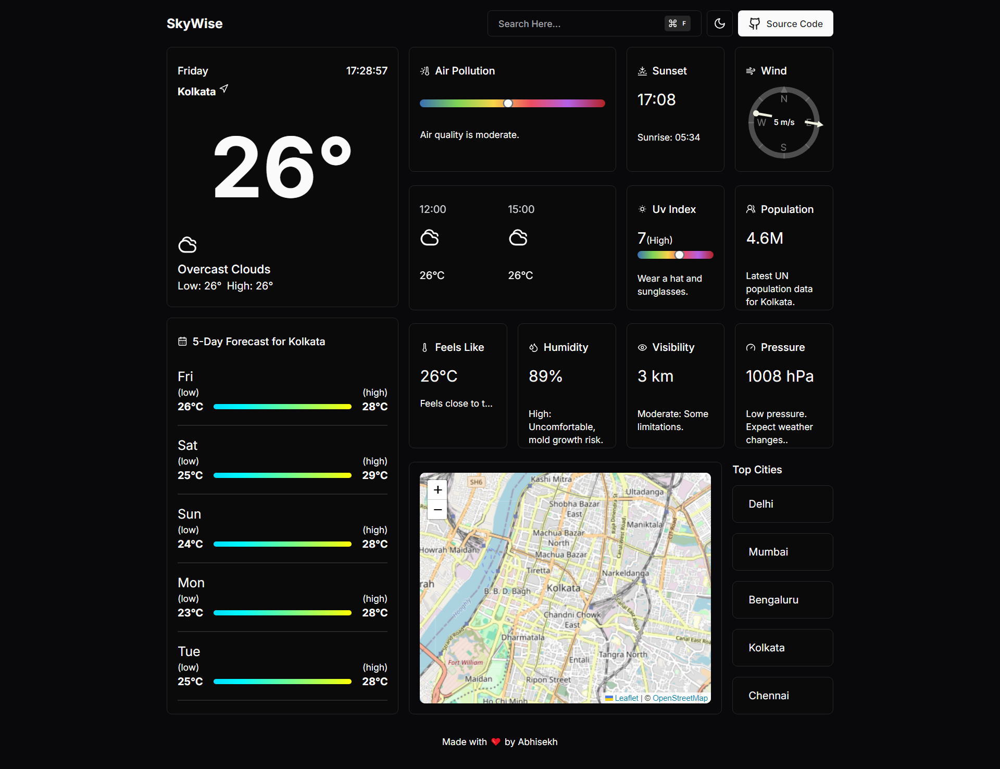

# 🌤️ SkyWise App 🌦️

Welcome to the **SkyWise App**! 
This project is a feature-rich weather application providing real-time weather updates, detailed forecasts, air quality information, and much more! 🌍✨

## 🚀 Features

- **Current Weather**: Get the latest weather conditions for your location. 🌡️
- **Five-Day Forecast**: Plan ahead with an accurate five-day weather forecast. 📅
- **Air Quality Index**: Stay informed about the air quality levels in your area. 🌫️
- **UV Index**: Check the UV index to protect yourself from harmful rays. ☀️
- **Interactive Map**: Visualize weather data dynamically using Mapbox. 🗺️

## 🛠️ Technologies Used

- **React**: A powerful JavaScript library for building dynamic UIs. ⚛️
- **Next.js**: A React framework for server-side rendering and optimized performance. 🚀
- **Leaflet**: A versatile library for interactive maps and geospatial data. 🗺️
- **OpenWeatherMap API**: Fetch real-time weather data from a trusted source. ☁️
- **Radix UI**: Accessible and customizable UI components for a seamless user experience. 🎨

## 📦 Installation

To get started with the SkyWise App, follow these steps:

1. Clone the repository:
   ```bash
   git clone https://github.com/AbhisekhNayek/SkyWise.git
   cd SkyWise
   ```

2. Install dependencies:
   ```bash
   npm install
   ```

3. Run the application:
   ```bash
   npm run dev
   ```

4. Open your browser and navigate to `http://localhost:3000` to view the app. 🌐

## 📸 Screenshots



## 🧪 Testing

To run tests for the SkyWise App, use:
```bash
npm run test
```

## 🤝 Contributing

Contributions are welcome! If you have ideas for improvement, feel free to fork the repo and submit a pull request. 🛠️

## 👤 Author

Created with passion by [Abhisekh Nayek](https://github.com/AbhisekhNayek) ❤️

---

Thank you for exploring the **SkyWise App**! Enjoy the experience and stay informed with the latest weather updates. 🌈
